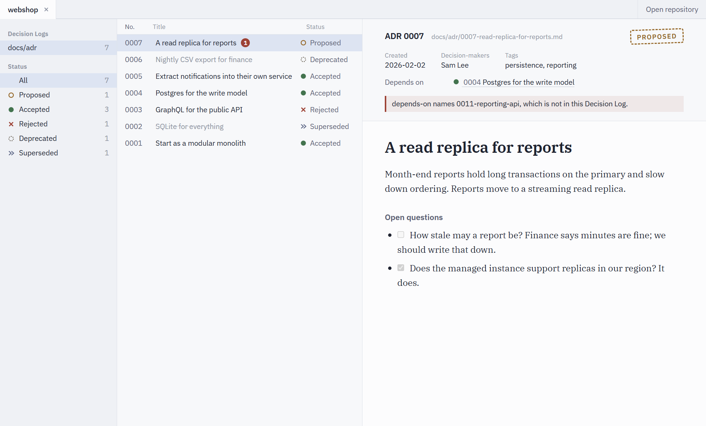
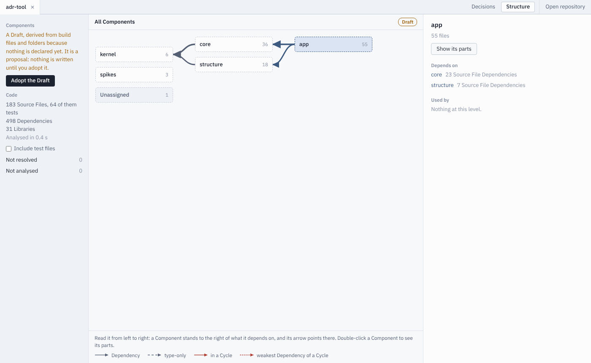

# ADR Tool

A desktop application for browsing, writing and relating the Architecture Decision Records that live in a git repository. Working title; early development.



## Documents

- [CONTEXT.md](CONTEXT.md) — the domain language. Code uses these terms.
- [docs/adr/](docs/adr/) — the decisions this project rests on, written in the tool's own format.
- [docs/plan.md](docs/plan.md) — milestones towards v1.
- [docs/roadmap.md](docs/roadmap.md) — what is in v1 and what comes after.
- [docs/vision.md](docs/vision.md) — where the project is heading: the ADR tool as the first module of an architect's suite. Its vocabulary is mapped in [CONTEXT-MAP.md](CONTEXT-MAP.md).
- [docs/plan-structure.md](docs/plan-structure.md) and [docs/structure-format.md](docs/structure-format.md) — the plan and the contract of the second module, Structure: Components, Dependencies, Cycles.

## Development

Requires Node 22.12 or newer and pnpm 11.

```bash
pnpm install
```

```bash
pnpm dev
```

The app reopens the repositories of the last run. To see every Status, Relations and a Problem at once, open the showcase Decision Log in `packages/core/test/fixtures/showcase`.

**Structure** is the second button in the header: it shows the Components of the repository in front and the Dependencies between them, a Draft as long as nothing is declared. To see a Cycle between two Components with its weakest Dependency, and one between two files, open `packages/structure/test/fixtures/shop` — with the whole path, since `pnpm dev` runs in `packages/app`:

```bash
ADR_TOOL_REPO="$PWD/packages/structure/test/fixtures/shop" pnpm dev
```



`pnpm test`, `pnpm typecheck`, `pnpm lint`, `pnpm format:check` and `pnpm build` are what CI runs, on Linux for now; Windows and macOS are switched off until distribution (see [roadmap.md](docs/roadmap.md)).

## Layout

- `packages/kernel` — what every module of the suite needs and none of them owns: the file-system port, splice edits and change sets ([ADR-0006](docs/adr/0006-one-core-package-per-module-on-a-shared-kernel.md)).
- `packages/core` — the domain core of the Decisions module in pure TypeScript. No Electron, no DOM, no disk access of its own; its type check fails if it reaches for any of them.
- `packages/structure` — the core of the Structure module, under the same guard: Components, Source Files and who owns them, the Draft, Adopt, and the Dependencies and Cycles of TypeScript, JavaScript and Svelte ([structure-format.md](docs/structure-format.md)). It reads build files as text and never runs anything of the repository it looks at ([ADR-0007](docs/adr/0007-the-analysis-never-executes-anything-from-the-analysed.md)), and parses without a type checker ([ADR-0008](docs/adr/0008-dependencies-come-from-parsers-alone-without-a-type-checker.md)). Its entry `@adr-tool/structure/model` is everything but the parsers: that is what the app's main process and renderer use, while the analysis runs in a worker thread.
- `packages/spikes` — temporary: the Java half of the Structure module's first spikes ([plan-structure.md](docs/plan-structure.md)). It moves into `packages/structure` with part 4.
- `packages/app` — the Electron + Svelte 5 desktop app. The renderer is sandboxed and talks to the main process only through the preload bridge.

Prettier never formats Markdown in this repository, and the fixtures under `packages/core/test/fixtures` are exempt from git's line-ending normalization: the tool promises never to change a byte it was not asked to change ([ADR-0002](docs/adr/0002-never-reserialize-markdown.md)), and its own repository is its first test case.
